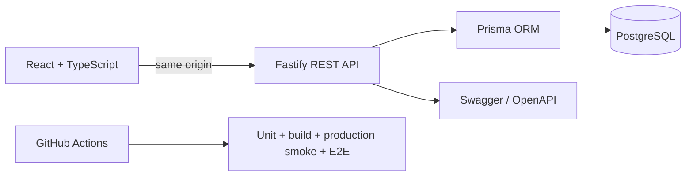

# Admin Board

**Full-stack helpdesk dashboard for support teams.**

**Live Demo:** deployment configuration is ready — the real public URL is added after the first Render Blueprint deploy.
**API Docs:** `/docs` on the deployed application.

**Portfolio demo account**

```text
demo@adminboard.app
PortfolioDemo!2026
```


Admin Board is a SaaS-style support workspace with authentication, server-side authorization, ticket CRUD, search and filters, analytics, user access management, PostgreSQL persistence and automated browser checks.

## Product screens

### Analytics

Metrics are calculated from current PostgreSQL data through the REST API.


### Users and permissions

Roles provide a base access level and individual permissions can extend it. The backend reloads the current user for authenticated requests, so access changes are not trusted from stale JWT role data.


## What the project demonstrates

- authenticated React application with protected routes;
- `admin`, `manager` and `user` roles;
- granular per-user permissions enforced by Fastify;
- ticket create, edit and delete flows;
- optimistic ticket status updates;
- server-side search, filtering, sorting and pagination;
- PostgreSQL + Prisma migrations;
- analytics based on database state;
- Swagger / OpenAPI documentation;
- responsive desktop and mobile UI;
- explicit loading, error and empty states;
- resettable public portfolio demo;
- Vitest + React Testing Library;
- Playwright browser E2E;
- single-origin production deployment;
- GitHub Actions with production smoke verification.

## Stack

### Frontend

React, TypeScript, React Router, TanStack Query, React Hook Form, Zod, Recharts, Vite and Lucide React.

### Backend

Node.js, Fastify, TypeScript, PostgreSQL, Prisma, JWT/httpOnly cookies and Swagger/OpenAPI.

### Quality and delivery

Vitest, React Testing Library, Playwright, ESLint, Prettier, Docker Compose and GitHub Actions.

## Architecture



Detailed notes: [docs/ARCHITECTURE.md](docs/ARCHITECTURE.md)

## Demo safety

The public demo uses a dedicated database and public demo credentials. On successful demo login the workspace is restored to a known baseline. Visitors can try CRUD and permissions without permanently destroying the presentation dataset. Registration is disabled only in public demo mode.

## Local development

Requirements: Node.js 22+ and Docker/PostgreSQL.

```bash
npm install
cp .env.example .env
npm run setup
npm run dev
```

Local URLs:

- frontend: `http://localhost:5173`
- API: `http://localhost:3001`
- Swagger: `http://localhost:3001/docs`

Local seed accounts remain separate from the production portfolio demo.

## Useful commands

```bash
npm run dev
npm run setup
npm run build
npm run lint
npm run test
npm run test:e2e
npm run screenshots
npm run format:check
npm run db:migrate
npm run db:seed
```

## Deployment

`render.yaml` defines the recommended single-origin deployment with an always-on Node web service, managed PostgreSQL, Prisma migrations before deploy, generated JWT secrets and check-gated automatic deployment.

See [docs/DEPLOYMENT.md](docs/DEPLOYMENT.md).

After Render creates the public URL, the final documentation commit should replace the deployment-ready note above with real **Live Demo** and **API Docs** links and use the same URL as the GitHub repository Homepage.
