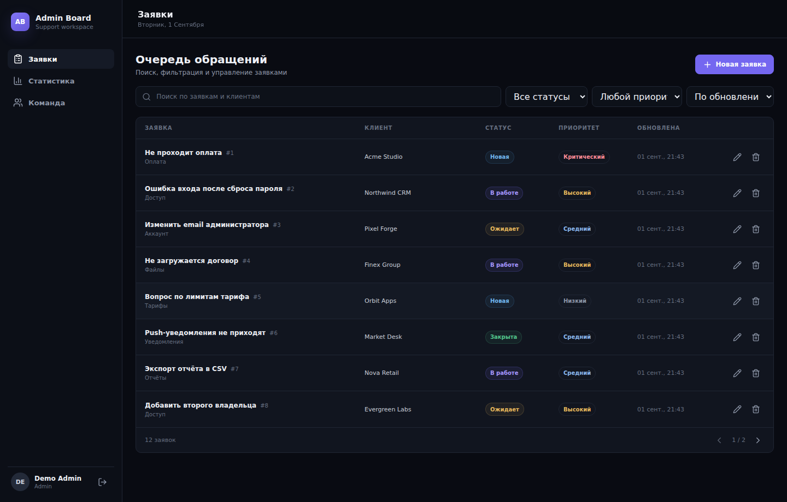
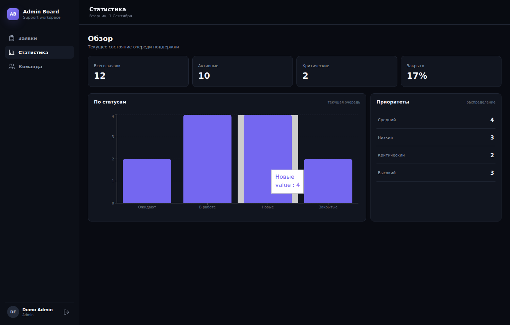
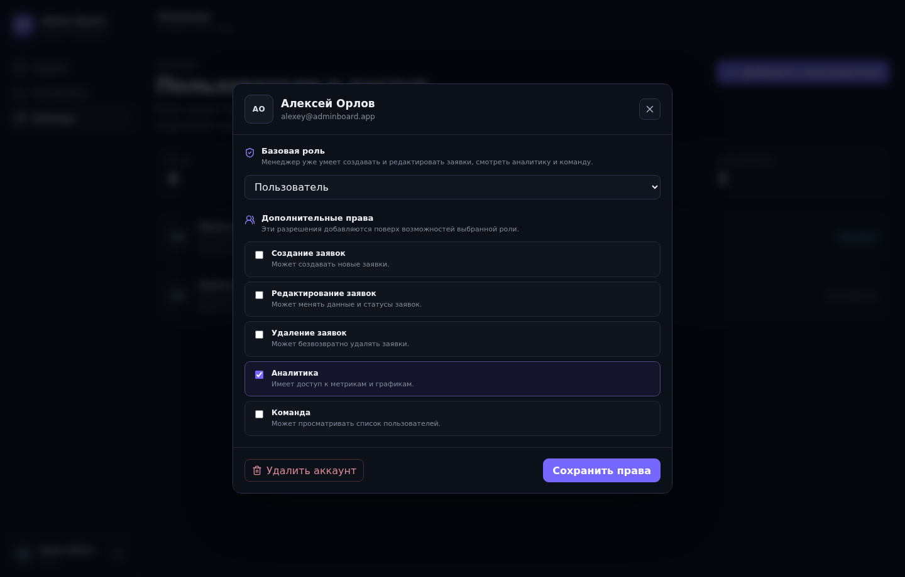

# Admin Board

Fullstack-панель для работы с обращениями клиентов и командой поддержки.

[GitHub](https://github.com/Superdeazi2/admin-board) · [GitLab](https://gitlab.com/Deazi/admin-board)



## Что реализовано

- вход в аккаунт и роли пользователей;
- создание, редактирование и удаление заявок;
- поиск, фильтры, сортировка и пагинация;
- аналитика по заявкам;
- управление пользователями и правами доступа;
- отдельный REST API;
- серверная валидация и работа с PostgreSQL;
- тесты frontend/backend сценариев.

## Почему этот проект важен в портфолио

Admin Board показывает не только UI, но и полный рабочий контур приложения:

```text
React / TypeScript
        |
React Router + TanStack Query
        |
REST API / Fastify
        |
Prisma
        |
PostgreSQL
```

Frontend работает с серверным состоянием, формами и валидацией. Backend отвечает за API и данные. Проект можно запускать локально через Docker Compose и проверять через Swagger/OpenAPI.

## Скриншоты

### Аналитика



### Пользователи и права



## Стек

**Frontend:** React, TypeScript, React Router, TanStack Query, React Hook Form, Zod, Recharts, Vite.

**Backend:** Node.js, Fastify, TypeScript, Prisma, PostgreSQL.

**Quality / tooling:** Swagger / OpenAPI, Vitest, Playwright, ESLint, Prettier, Docker Compose.

## Локальный запуск

Нужны Node.js 22+ и Docker.

```bash
npm install
cp .env.example .env
npm run setup
npm run dev
```

После запуска:

- frontend: `http://localhost:5173`
- API: `http://localhost:3001`
- Swagger: `http://localhost:3001/docs`

## Тестовые аккаунты

Администратор:

```text
admin@mail.ru
Admin123!
```

Менеджер:

```text
manager@mail.ru
Admin123!
```

Для публичной demo-версии следует использовать отдельные данные/учётные записи.

## Repository mirrors

GitLab и GitHub используются как публичные зеркала проекта.

- GitLab: https://gitlab.com/Deazi/admin-board
- GitHub: https://github.com/Superdeazi2/admin-board
