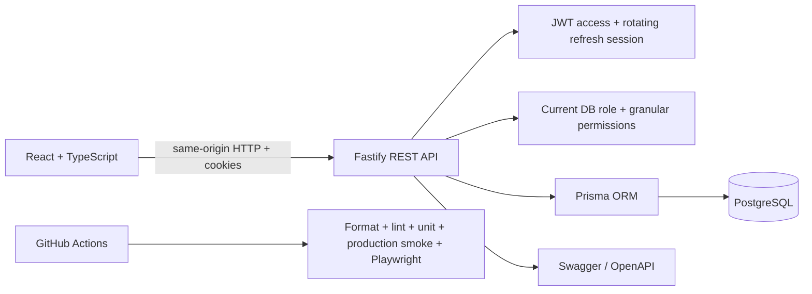

# Architecture

Admin Board is an npm-workspace full-stack helpdesk application.

## Frontend

`apps/web` owns routing, forms, product UI and remote state.

- React Router handles public and protected routes.
- Protected feature routes respect the current permission set.
- TanStack Query owns server state and optimistic ticket updates.
- React Hook Form + Zod handle authentication and ticket forms.
- Recharts renders analytics.
- Heavy protected pages are lazy-loaded.

## Backend

`apps/api` owns authentication, authorization and persistence.

- Access JWTs are short-lived and stored in httpOnly cookies.
- Refresh tokens are opaque random values stored as hashes in PostgreSQL.
- Authentication verifies the JWT and reloads the current user from PostgreSQL, so role or permission changes take effect immediately.
- Role permissions and granular user permissions are enforced server-side.
- Prisma migrations describe the PostgreSQL schema.
- Swagger is exposed at `/docs`.

## Portfolio demo boundary

Production demo mode uses a dedicated managed database. A successful login with the public demo account restores baseline users and tickets before the session is issued.

Visitors can try ticket CRUD, analytics and access management. Public registration is disabled in demo mode, and the next demo login restores the presentation dataset.

## Delivery

GitHub Actions verifies formatting, lint, unit tests, build, a production-mode single-origin smoke test and browser E2E flows against PostgreSQL.
